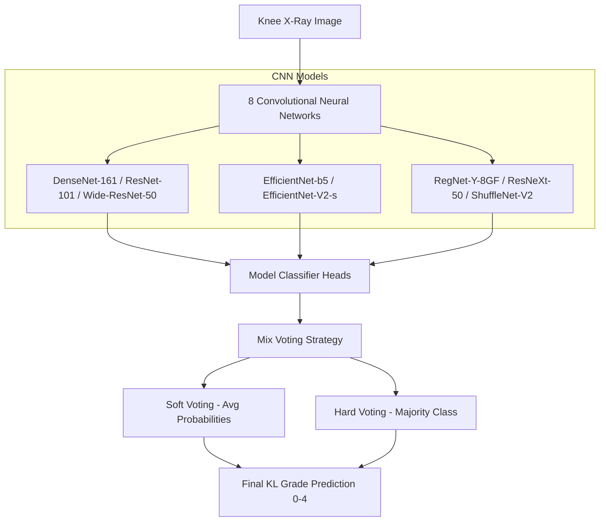

# Ensemble deep‐learning networks for automated osteoarthritis grading in knee X‐ray images

## Overview
This repository contains the code and resources for the paper ["Ensemble deep‐learning networks for automated osteoarthritis grading in knee X‐ray images"](https://www.nature.com/articles/s41598-023-50210-4). The aim of this project is to develop an ensemble network that predicts the Kellgren-Lawrence (KL) grade for knee osteoarthritis (OA) severity using a deep learning approach.


## Introduction
Osteoarthritis (OA) is a common joint disease that affects millions of people worldwide. The Kellgren-Lawrence (KL) grading system is the standard for classifying the severity of knee OA using X-ray images. However, the grading depends on the clinician’s subjective assessment, leading to significant variability. This project proposes an ensemble deep learning model that provides consistent and accurate KL grade predictions.

## Dataset
The dataset used in this study is from the Osteoarthritis Initiative (OAI), which consists of 8260 knee X-ray images. The dataset includes images for KL grades ranging from 0 to 4. It is publicly available and can be accessed [here](https://data.mendeley.com/datasets/56rmx5bjcr/1).

## Model architecture
The ensemble network consists of eight Convolutional Neural Networks (CNNs):
- DenseNet-161
- EfficientNet-b5
- EfficientNet-V2-s
- RegNet-Y-8GF
- ResNet-101
- ResNext-50-32x4d
- Wide-ResNet-50-2
- ShuffleNet-V2-x2-0

Each model is trained with its optimal image size to enhance performance. The models leverage pre-trained weights from [`torchvision.models`](https://pytorch.org/vision/stable/models.html). Combining architectures with different inductive biases (dense connectivity, compound scaling, grouped convolutions, channel shuffling) allows the ensemble to effectively capture both fine-grained knee joint details and overall anatomical structure. The final prediction is made using a mix voting method, which combines hard and soft voting strategies.




## Training strategy
The training process involves the following steps:
1. Models are trained using different image sizes.
2. The initial layers are frozen, and only the fully connected layers are trained with a learning rate of 0.01.
3. Subsequently, all layers are unfrozen, and the learning rate is reduced progressively to stabilize training.
4. Stratified five-fold cross-validation is used to handle class imbalance and improve generalization.

## License
Ensemble deep‐learning networks for automated osteoarthritis grading in knee X‐ray image is released under the [MIT License](LICENSE).

## Citation
```
Chen, Pingjun (2018), “Knee Osteoarthritis Severity Grading Dataset”, Mendeley Data, V1, doi: 10.17632/56rmx5bjcr.1
```
